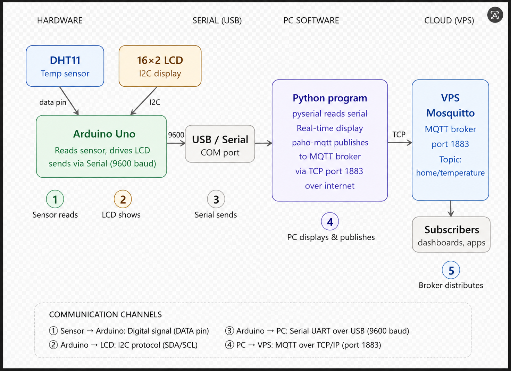
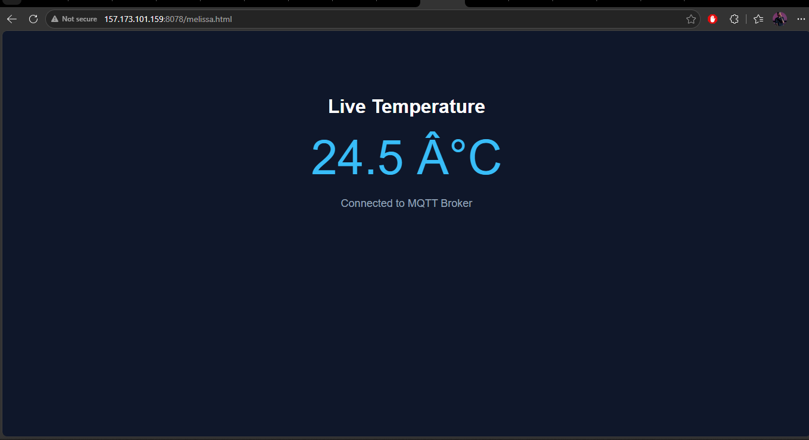
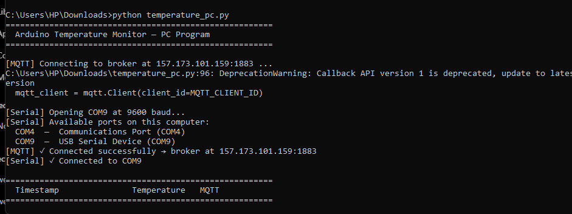

# 🌡️ IoT Temperature Monitoring System (Arduino + MQTT + VPS Dashboard)

This project is a complete embedded IoT system that reads temperature using an Arduino Uno and DHT sensor, displays it on an LCD, sends data to a PC via Serial communication, publishes it to an MQTT broker hosted on a VPS, and visualizes it on a live web dashboard.

---

## 📌 System Overview

- Reads temperature from a DHT sensor using Arduino Uno
- Displays:
  - Row 1: Student name (with horizontal scrolling if >16 characters)
  - Row 2: Real-time temperature value on 16x2 LCD
- Sends temperature data to PC using Serial communication
- PC program:
  - Reads serial data
  - Displays values in real-time terminal
  - Publishes data to MQTT broker (VPS)
- Web dashboard:
  - Subscribes to MQTT topic
  - Displays live temperature updates

---

## 🧠 System Architecture



---

## 🔌 Hardware Connections

### DHT Sensor (DHT11 / DHT22)
- VCC → 5V
- GND → GND
- DATA → Digital Pin 7

### LCD 16x2 (I2C)
- SDA → A4
- SCL → A5
- VCC → 5V
- GND → GND

---

## 🔄 Communication Flow
DHT Sensor → Arduino Uno → LCD Display
↓
Serial (USB)
↓
PC Python Program
↓
MQTT Broker (VPS)
↓
Web Dashboard (HTML + JS)

---

## 💻 Software Components

### 1. Arduino Program
- Reads temperature every 1 second
- Displays scrolling name on LCD row 1
- Displays temperature on LCD row 2
- Sends data:
TEMP:24.5

---

### 2. PC Python Program

Features:
- Reads serial data from Arduino
- Displays live readings in terminal
- Publishes to MQTT topic:  
home/temperature

Install dependencies:
```bash
pip install pyserial paho-mqtt
```
Run:
```bash
python temperature_pc.py
```
### 3. MQTT Broker (VPS)
Broker IP:
157.173.101.159

Port:
1883 (MQTT)
9001 (WebSocket)

Topic:
home/temperature
4. Web Dashboard

## Live dashboard URL:http://157.173.101.159:8078/melissa.html
Features:

Real-time temperature updates
MQTT WebSocket connection
Minimal UI dashboard
## 📸 Screenshots
### Working Dashboard(A screenshoot of instance where dashboard was working)


### Python output( A screen shot of the output of python program)


## 🚀 How to Run the System

Step 1: Arduino
Open Arduino IDE
Install libraries:

DHT sensor library
Adafruit Unified Sensor
LiquidCrystal I2C
Upload ArduinoCode.ino

Step 2: PC Program
pip install pyserial paho-mqtt
python temperature_pc.py

Make sure:

Correct COM port is set (e.g. COM9)
Step 3: VPS MQTT Broker

Ensure:

Mosquitto installed
Port 1883 open
WebSocket enabled on 9001
Step 4: Web Dashboard

## Open in browser:

http://157.173.101.159:8078/melissa.html

## 🧪 Features Implemented

✔ Real-time temperature sensing
✔ LCD display with scrolling text
✔ Serial communication Arduino → PC
✔ MQTT publishing from PC
✔ VPS-hosted broker
✔ Live web dashboard
✔ End-to-end IoT pipeline

## 👩‍💻 Author

Melissa
Rwanda Coding Academy
Embedded Systems & Software Programming Student

